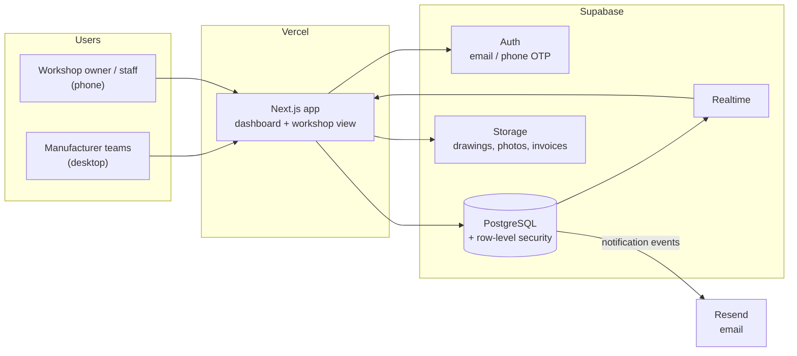
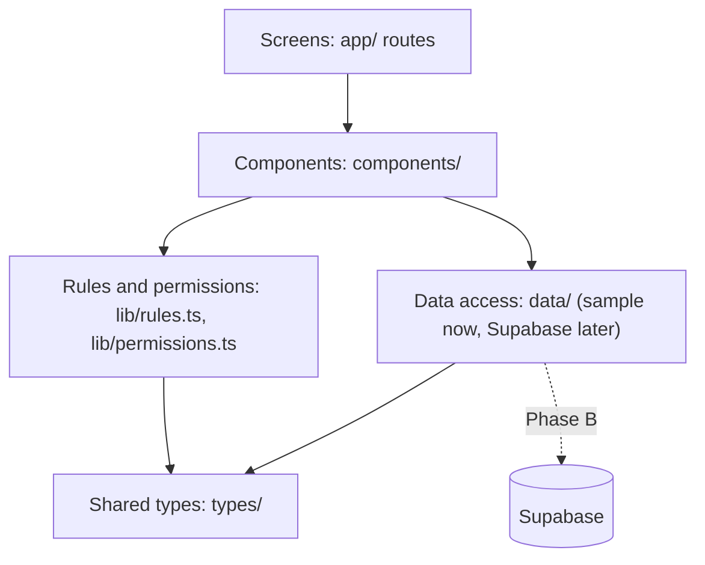
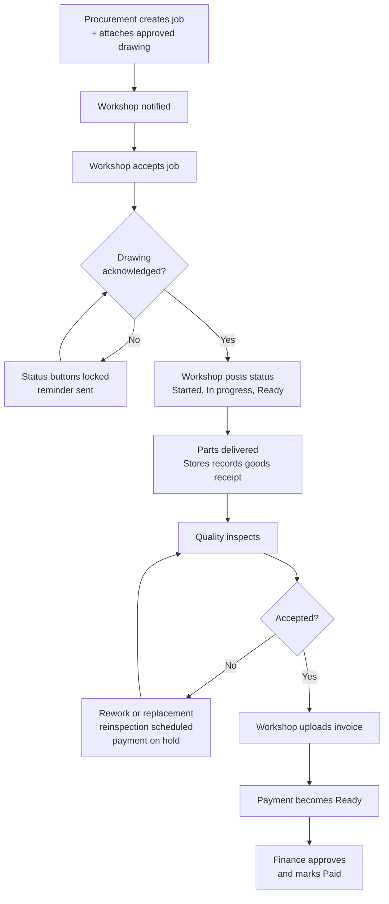
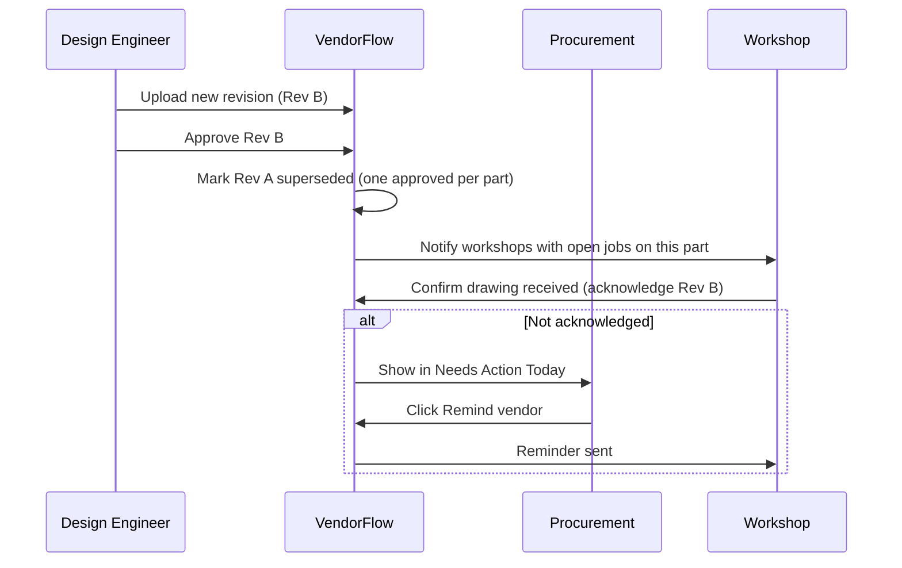
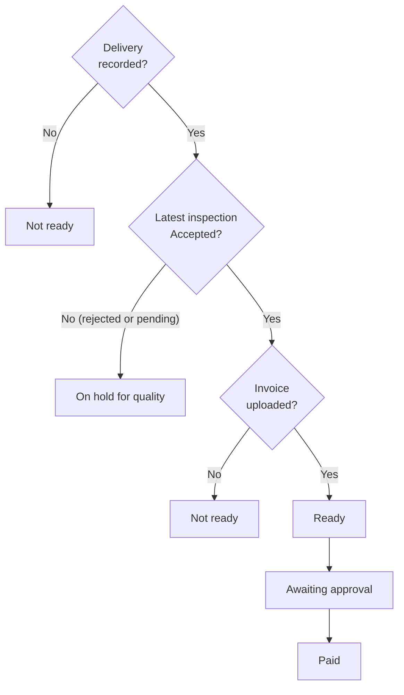
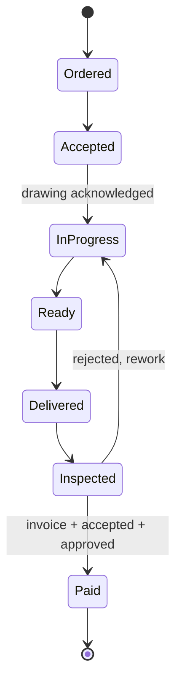
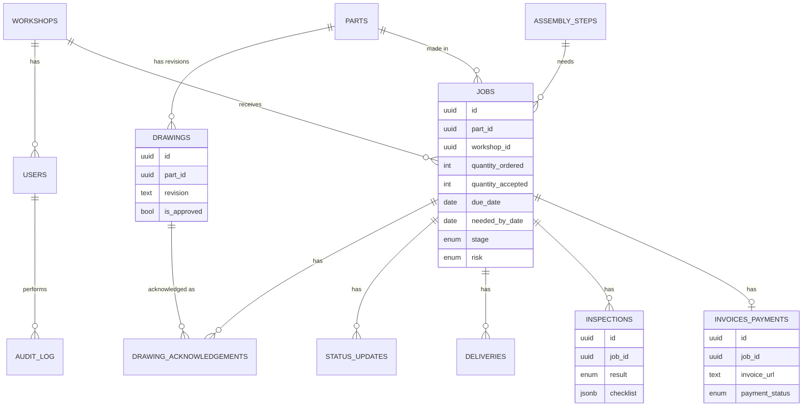
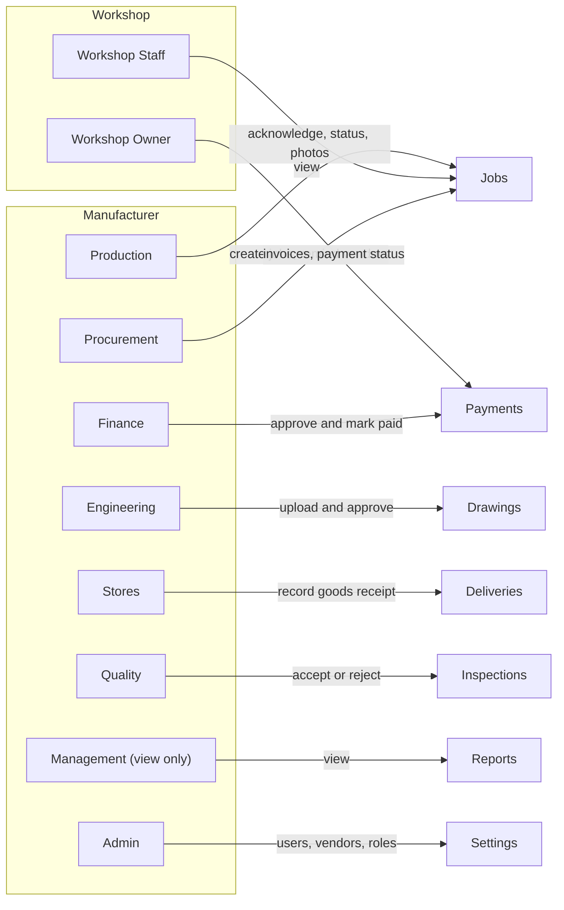
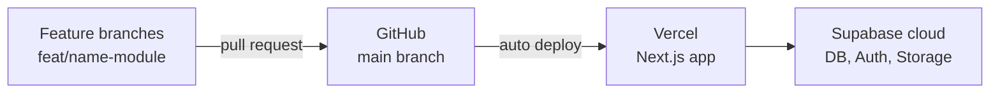

# VendorFlow: System Design and Flows

Diagrams use Mermaid and render automatically on GitHub and in VS Code (Markdown Preview Mermaid extension).

## 1. Architecture

## 2. Application layers

Rule: screens never contain business logic. They call `lib/rules.ts` and read data through small functions such as `getJobs()`, so Supabase can replace the sample data without changing screens.

## 3. Order to payment flow

## 4. Drawing change flow

## 5. Payment readiness decision

Implemented once in `lib/rules.ts` (`getPaymentStatus`) and mirrored by `payment_readiness()` in `supabase/schema.sql`.

## 6. Job stages

Risk values (separate from stage): On track, At risk, May miss date, Reinspection due, Overdue.

## 7. Data model

## 8. Roles and access

A workshop user only ever sees its own jobs (row-level security in Phase B, filtering in the prototype).

## 9. Assembly shortfall

For each assembly date in the next 14 days:
- needed = sum of `parts_needed` of assembly steps on that date
- ready = sum of accepted quantity of the jobs linked to those steps
- shortfall = needed minus ready (shown in red, linked to the jobs causing it)

Example from the mockup: Fri 09, 60 needed, 45 ready, shortfall 15.

## 10. Notifications (version 1: in-app and email)

| Event | Notified | Channel |
|---|---|---|
| New revision approved | Affected workshops | In-app, email |
| Revision not acknowledged | Procurement; reminder to workshop | In-app, email |
| Job nearing due date | Procurement | In-app, email |
| No update for set days | Procurement | In-app |
| Inspection rejected | Procurement, workshop | In-app, email |
| Payment ready | Finance | In-app |
| Payment paid | Workshop | In-app, email |

## 11. Deployment

